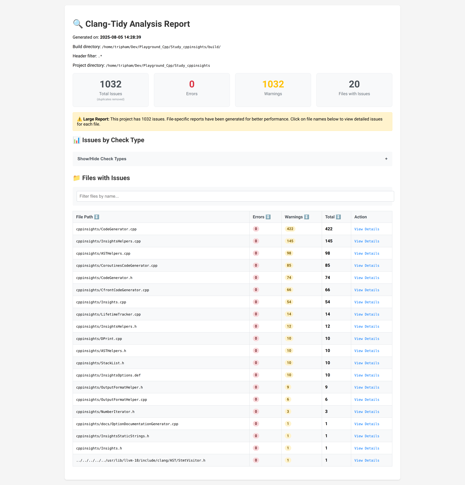
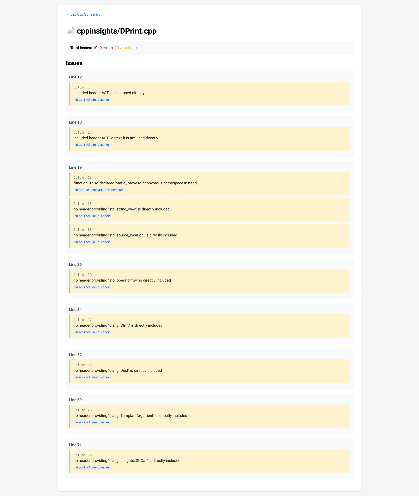
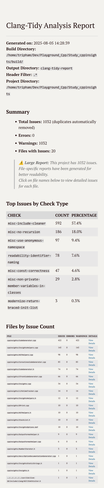
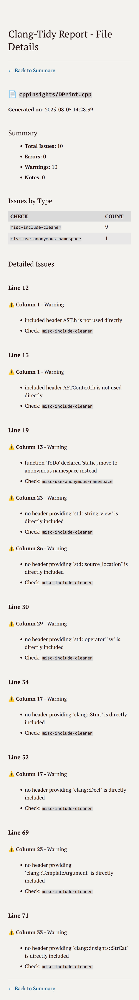

# Clang-Tidy Full Report Generator

A comprehensive Python script that runs clang-tidy on C/C++ projects and generates detailed reports in multiple formats (HTML, Markdown, JSON, CSV).

## Features

- 🚀 **Parallel Processing**: Automatically uses 2/3 of CPU cores for faster analysis
- 📊 **Multiple Output Formats**: HTML, Markdown, JSON, and CSV reports
- 📁 **Smart File Handling**: Splits large reports into manageable per-file reports
- 🎯 **Flexible Filtering**: Include/exclude files and directories with glob patterns
- 📍 **Project-Relative Paths**: Clean, readable paths in reports
- 🔍 **Header Analysis**: Optionally include warnings from header files
- ⚡ **Real-time Progress**: Shows which files are being processed during analysis
- 🔄 **Automatic Deduplication**: Removes duplicate warnings (common with header files)

## Prerequisites

- Python 3.6+
- clang-tidy installed and in PATH (tested with clang-tidy version 18)
- A C/C++ project with `compile_commands.json` (generated by CMake, Bear, etc.)
- Optional: `tqdm` for better progress bars (`pip install tqdm`)

## Basic Usage

```bash
# Analyze a project with default settings
./clang_tidy_full_report.py build/

# Generate HTML and Markdown reports only
./clang_tidy_full_report.py build/ --format=html,markdown

# Save reports to a specific directory
./clang_tidy_full_report.py build/ --output reports/
```

## Common Use Cases

### 1. Full Project Analysis with Headers

```bash
./clang_tidy_full_report.py build/ --header-filter='.*' --parallel
```

- Analyzes all source and header files
- Uses parallel processing for speed
- Generates all report formats

### 2. Exclude External Dependencies

```bash
./clang_tidy_full_report.py build/ \
  --exclude="external/**,third_party/**,build/**" \
  --header-filter='(?!external).*'
```

- Excludes common dependency directories
- Only analyzes your project's code

### 3. Quick Analysis with Specific Checks

```bash
./clang_tidy_full_report.py build/ \
  --checks="-*,performance-*,readability-*" \
  --format=markdown \
  --print=quiet
```

- Runs only performance and readability checks
- Generates only Markdown report
- Suppresses console output

### 4. Large Project with Clean Output

```bash
./clang_tidy_full_report.py build/ \
  --project-dir=/path/to/project \
  --parallel --jobs=8 \
  --exclude="**/*_test.cpp,**/*_unittest.cpp"
```

- Uses project-relative paths in reports
- Uses 8 parallel jobs
- Excludes test files
- Automatically splits large reports

### 5. CI/CD Integration

```bash
./clang_tidy_full_report.py build/ \
  --format=json \
  --output=ci-reports/ \
  --print=quiet \
  --exclude="generated/**"
```

- JSON output for parsing by CI tools
- Silent operation
- Excludes generated code

## Key Options

| Option              | Description                       | Example                            |
| ------------------- | --------------------------------- | ---------------------------------- |
| `--header-filter`   | Include warnings from headers     | `--header-filter='.*'`             |
| `--exclude`         | Exclude files/directories         | `--exclude="external/**,tests/**"` |
| `--format`          | Output format(s)                  | `--format=html,json`               |
| `--parallel`        | Use parallel processing           | `--parallel --jobs=16`             |
| `--project-dir`     | Base directory for relative paths | `--project-dir=.`                  |
| `--checks`          | Specify clang-tidy checks         | `--checks="-*,google-*"`           |
| `--output`          | Output directory                  | `--output=reports/`                |
| `--print`           | Console output mode               | `--print=verbose`                  |
| `--debug-parsing`   | Show detailed parsing info        | `--debug-parsing`                  |
| `--save-raw-output` | Save clang-tidy output            | `--save-raw-output`                |

## Output Examples

### HTML Report

- **Main report**: `clang_tidy_report.html` - Interactive dashboard with charts


- **File reports**: `clang_tidy_report_file_*.html` - Detailed issues per file (for large projects)


### Markdown Report

- **Main report**: `clang_tidy_report.md` - Summary with tables and statistics


- **File reports**: `clang_tidy_report_file_*.md` - Detailed issues per file (for large projects)


### JSON Report

- `clang_tidy_report.json` - Machine-readable format with complete data

### CSV Report

- `clang_tidy_report.csv` - Spreadsheet-compatible format

## Advanced Features

### Test Exclusion Patterns

```bash
# Test if a file would be excluded
./clang_tidy_full_report.py build/ \
  --exclude="external/**" \
  --test-exclude "external/lib/test.cpp"
```

### Generate Configuration File

```bash
# Create a sample .clang-tidy configuration
./clang_tidy_full_report.py --generate-config
```

### Debug Mode

```bash
# Show detailed analysis information
./clang_tidy_full_report.py build/ --debug --limit=10
```

## Tips

1. **For large projects**: Use `--parallel` and let the script split reports automatically

2. **For CI/CD**: Use `--format=json` and `--print=quiet`

3. **For code reviews**: Use `--format=markdown` with `--project-dir=.`

4. **For quick checks**: Limit scope with `--exclude` and specific `--checks`

5. **Header file analysis**: When using `--header-filter`, the script automatically removes duplicate warnings that occur when the same header is included by multiple source files

6. **Cross-machine debugging**: When getting different results on different machines:

   ```bash
   # Run this on both machines and compare outputs:
   ./clang_tidy_full_report.py build/ --limit 1 --save-raw-output --debug-parsing
   # Compare: raw_output_1_*.txt files between machines
   ```

### Troubleshooting

If the script produces no warnings on certain machines, use the debug options:

### Quick Test

```bash
# Test if clang-tidy is working correctly
./clang_tidy_full_report.py --test-clang-tidy

# Test with your build directory
./clang_tidy_full_report.py --test-clang-tidy build/
```

This will:

- Check if clang-tidy is installed and accessible
- Show version information
- Create a test file with known issues
- Verify that clang-tidy can detect problems
- Test with your compile_commands.json (if build dir provided)

### Debug Options

```bash
# Show detailed parsing information
./clang_tidy_full_report.py build/ --debug-parsing

# Save raw clang-tidy output to files
./clang_tidy_full_report.py build/ --save-raw-output

# Combined debugging with limited files
./clang_tidy_full_report.py build/ --debug-parsing --save-raw-output --limit 5
```

### Debug Output Files

When using debug options, the script generates:

- `debug_summary.txt` - Summary of configuration, environment, and warnings found
- `warnings_debug.json` - First 100 warnings in JSON format for analysis
- `raw_output_*.txt` - Raw clang-tidy output for each file (with `--save-raw-output`)

### Common Issues

1. **No warnings found**: Check `debug_summary.txt` for:
   - Clang-tidy version differences
   - Configuration file differences
   - Path resolution issues
   - Check patterns being used

2. **Different results on different machines**: Compare:
   - Clang-tidy versions (`clang-tidy --version`)
   - .clang-tidy configuration files
   - Build directory paths
   - Compiler flags in compile_commands.json

### Quick Diagnostics

When the script works on one machine but not another:

```bash
# 1. Test clang-tidy installation
./clang_tidy_full_report.py --test-clang-tidy

# 2. Run minimal analysis with full debugging
./clang_tidy_full_report.py build/ \
  --limit 1 \
  --debug-parsing \
  --save-raw-output \
  --format=json

# 3. Check the generated files:
# - debug_summary.txt (configuration and environment)
# - raw_output_*.txt (actual clang-tidy output)
# - warnings_debug.json (parsed warnings if any)
```

This will quickly identify:

- Version differences
- Path issues
- Parsing problems
- Configuration differences

## Known Issues Solved

- **Duplicate warnings**: When running in parallel mode or analyzing header files, clang-tidy may report the same warning multiple times (especially for headers included by multiple source files). The script automatically detects and removes these duplicates based on file, line, column, and warning type.
